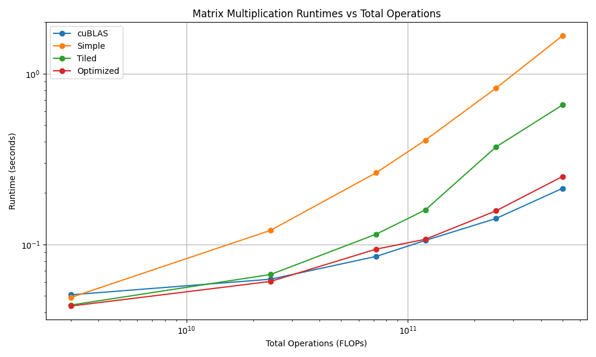

This repository contains implementations of matrix multiplication algorithms for both GPU and CPU with different optimizations. CUDA implementation (`float_cuda_2d_tiled_register_cache_matrix_multiplication.cu`) is 17.3 % slower than `cublasSgemm()` from `cublas_v2.h` and 567 % faster than algorithm without any optimizations on large matrices. 

